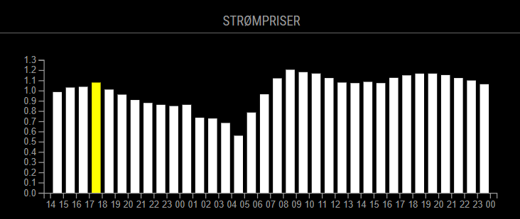

# Module: NOK Electricity Forecast

The `NOKelectricityForecast` ("Norwegian Electricity Prices Forecast") module offers a comprehensive view of hourly electricity prices in Norway for the forthcoming 48 hours. Through line and bar charts this module delivers electricity pricing, aiding users in optimizing their energy utilization patterns.

Add the departure board to your configuration file, for instance:

```js
//Line Chart Example:
{
    module: "MMM-NOKElectricityForecast",
    position: "bottom_bar",
    header: "Strømpriser",
    config: {
        updateInterval: 40000,
        chartType: "line",
        historicalData: 3,
        height: 150,
        width: 15,
        primaryColor: "white",
        secondaryColor: "red",
        dynamicYAxis: true,
        lineThickness: 3,
        currentHourLineThickness: 3,
        currentHourLineLenght: 1,
        yAxisExtention: 0.0
    },
},
```


```js
//Bar Chart Example:
{
    module: "NOKElectricityForecast",
    position: "bottom_bar", 
    header: "Electricity Prices",
    config: {
        updateInterval: 20000, 
        historicalData: 3, 
        height: 200, 
        width: 15, 
        chartType: "bar",
        primaryColor: "white",
        secondaryColor: "yellow",
        dynamicYAxis: false,
        barOffset: 10,
        barwidth: 10, 
    },
},
```


## Configuration

Configuration options are as follows:


| Option | Description | Default value |
|-------------|--------------------------------------------------|---------------|
| chartType | String. Can choose between bar and Line | "line" |
| historicalData | Integer. Amount of previous hours to show | 2 |
| height | Integer. Height of the module. | 5 |
| width | Integer.  Witdh of the module. Total width is calculated based on current amount of hours showing, so this is not the final width | 15 |
| primaryColor | String. D3.js color. Color of the line or the bars | "white" |
| secondaryColor | String. D3.js color. Color of the current hour marker | "yellow" |
| dynamicYAxis | Boolean. If you want the values on the Y-axis to be calculated dynamically based on the contents of the chart, if set to false minimum value will be 0, and maximum value will be calculated based on content | "true" |
| yAxisExtention | Decimal. Values between 0.0 and 0.9. Will extend y-axis values by chosen amount | 0.0
| barOffset | Integer. Used to center the bars in between the values. Depends on what you choose as barwidth | 10 |
| barwidth | Integer. The width of each bar in the barchart | 10 |
| lineThickness | Integer | Thickness of the line in the linechart |
| currentHourLineThickness | Thickness of the line marking the current hour | 3 |
| currentHourLineLenght | Length of the line marking the current hour | 0 |

